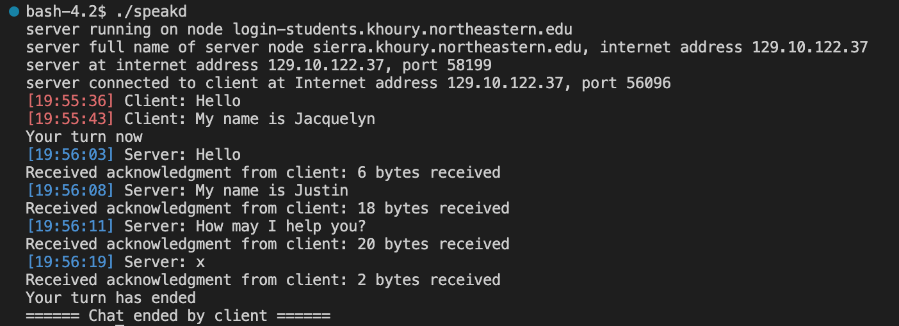
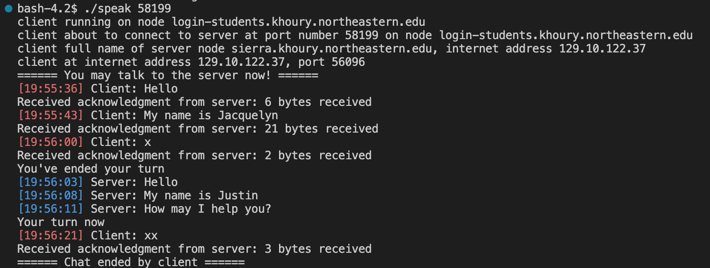

# Simple Chat Room

## Introduction
This project is designed to allow communication between a client and a server user in the C programming language. The client program is called "speak" and the server program is called "speakd". These two programs will communicate over a network using the socket interface and TCP protocol, ensuring a smooth and efficient chatting experience.

 
## Communication Protocol
A "x" on a line by itself means that the writer is finished with writing and the writing control should be shifted to the other side (half-duplex communication). A "xx" on a line by itself by either side means that the chat is over and the connection should be terminated.

## Running the Code
To run the Speak Chat Service, follow these steps:

1. Open a terminal and navigate to the directory where the "speakd" server program is located.
2. Start the server by typing in ./speakd and hitting enter.
3. In a separate terminal, navigate to the directory where the "speak" client program is located.
4. Start the client by typing in ./speak [Server Port Number] and hitting enter.
5. Follow the on-screen instructions and start chatting.
Note: Make sure that both the client and server programs are in the same network and able to communicate with each other.

## Built With
* C programming language
* Socket interface to TCP

## Additional Feature:
1. Added timestamp for message being sent
2. Added color for display to differentiate server and client message

## Communication Demo

#### 1. Server

#### 2. Client

## Author
Jacquelyn (Junting) Xiong
